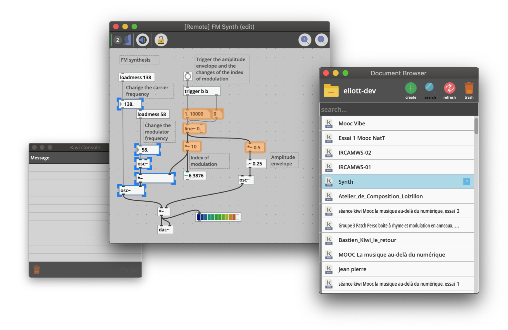

<p align="center">
  <h1 align="center">Kiwi</h1>
  <p align="center">
    A real-time collaborative audio patching software
  </p>
  <p align="center">
    <a href="https://travis-ci.org/Musicoll/Kiwi"></a>
    <a href="https://ci.appveyor.com/project/CICM/kiwi/history"></a>
  </p>
  <p align="center">
    <a href="http://kiwi.mshparisnord.fr/"></a>
    <a href="http://musicoll.github.io/Kiwi"></a>
    <a href="https://github.com/Musicoll/Kiwi/releases"></a>
  </p>
</p>

### Presentation

Kiwi is part of the French ANR-funded [MUSICOLL](http://musicoll.mshparisnord.org/) project that unites the [CICM](http://cicm.mshparisnord.org/) and [OhmForce](https://www.ohmforce.com/Company.do). The main goal of this project is to study how collaboration can enhance the way digital audio music composition is taught and more generally how it can improve music creation workflow.



Kiwi is a graphical programming environment dedicated to music creation in the spirit of other softwares like [Max](https://cycling74.com) or [Pure Data](https://puredata.info/).
Kiwi is also a realtime collaborative software that enables several distant users to work at the same time on a same patch hosted online.

- You can [download the latest version](https://github.com/Musicoll/Kiwi/releases) in the release page : [](https://github.com/Musicoll/Kiwi/releases)
- Access online [documentation](http://musicoll.github.io/Kiwi)

---

### Compilation

The compilation of Kiwi uses [CMake](https://cmake.org/). Most of the dependencies are included as git submodules, the others will be installed during automatically during the CMake configuration phase. Thus, the compilation requires the default git and CMake steps such as:

```
git clone https://github.com/Musicoll/Kiwi.git
cd Kiwi
git submodule update --init --recursive
mkdir Build && cd Build
cmake ..
cmake --build .
```

This default CMake approach downloads and compiles all the dependencies [Flip](http://developer.irisate.com/), [Boost](https://www.boost.org/) and [LLVM](http://llvm.org) but the CMake approach also allows to use the personal/systems libraries.

- Flip  
Enables or disable the personal/system library for Flip with the option `USE_SYSTEM_FLIP ON/OFF (default OFF)`. Flip must be compiled as a static library compatible with the commit **c47e41da05**.  Use the variable `FLIP_INCLUDE_DIRS PATHS` to define the Flip include directories and the variable `FLIP_LIBRARY_DIRS PATHS` to define the Flip library directories.

- Boost  
Enables or disable the personal/system library for Boost with the option `USE_SYSTEM_BOOST ON/OFF (default OFF)`. Boost must be compiled as a static library with the system component and compatible with the version **1.69.0**. See this [documentation](https://cmake.org/cmake/help/v3.0/module/FindBoost.html) for more options.

- LLVM  
Enables or disable the personal/system library for LLVM with the option `USE_SYSTEM_LLVM ON/OFF (default OFF)`. LLVM must be compiled as a static library (with the dynamic runtime on Windows) and compatible with the version **5.0.0**. See this [documentation](https://llvm.org/docs/CMake.html) for more options.

### Documentation

The documentation of Kiwi is available [online](http://musicoll.github.io/Kiwi) and with the distribution. Generating the documentation requires to install  [github-wikito-converter](https://github.com/yakivmospan/github-wikito-converter):
```
npm install -g github-wikito-converter
```
Then, from the **Kiwi root** folder, run:
```
python ./Scripts/gendoc.py
```

---

### Authors

[](https://github.com/eliottparis) | [](https://github.com/pierreguillot) | [](https://github.com/jean-millot)
---|---|---
[Eliott Paris](https://github.com/eliottparis) | [Pierre Guillot](https://github.com/pierreguillot) | [Jean Millot](https://github.com/jean-millot)

### Papers

- E. Paris, *Une Approche du patching audio collaboratif : Enjeux et développement du collecticiel Kiwi*, thèse de doctorat, sous la direction d'A. Sèdes et A. Bonardi, Université de Paris 8, 2018 - [URL](https://hal.archives-ouvertes.fr/tel-01970169v1) (fr).
- P. Galleron, E. Maestri, J. Millot, A. Bonardi, E. Paris, *Enseigner le patching de manière collective avec le logiciel collaboratif Kiwi*, Journées d’Informatique Musicale (JIM 2018), 2018, Amiens, France, pp.105-114. [URL](https://hal.archives-ouvertes.fr/hal-01791492/document) (fr).
- E. Paris, J. Millot, P. Guillot, A. Bonardi, A. Sèdes, *Kiwi : Vers un environnement de creation musicale temps reel collaboratif*, Journées d’Informatique Musicale (JIM 2017), 2017, Paris, France. [URL](https://hal.archives-ouvertes.fr/hal-01550190/document) (fr).
- A. Sèdes, A. Bonardi, E. Paris, J. Millot, P. Guillot, *Teaching, investigating, creating: MUSICOLL*. Innovative Tools and Methods for Teaching Music and Signal Processing, 2017. [URL](https://hal.archives-ouvertes.fr/hal-01581698/document) (en).

### Organizations

- [ANR MUSICOLL](http://musicoll.mshparisnord.org)
- [CICM](http://cicm.mshparisnord.org)
- [OhmForce](https://www.ohmforce.com/Company.do)
- [MSH Paris Nord](https://www.mshparisnord.fr)
- [Université Paris 8](https://www.univ-paris8.fr)

### Credits

- [Flip](http://developer.irisate.com/)
- [Juce](https://github.com/WeAreROLI/JUCE)
- [boost](https://www.boost.org/) / ([Beast](https://github.com/boostorg/Beast/))
- [concurrentqueue](https://github.com/cameron314/concurrentqueue)
- [json](https://github.com/nlohmann/json)
- [CMake](https://cmake.org/)
- [LLVM](http://llvm.org)
- [FAUST](https://github.com/grame-cncm/faust.git)
- [Icons by Freepik](https://www.flaticon.com/)

### License

The Kiwi application is licensed under the terms of the [GNU GPL-3.0](https://github.com/Musicoll/Kiwi/blob/master/Licence.md) license. However, Kiwi also depends on the [Flip](http://developer.irisate.com/) library which is NOT open-source.
