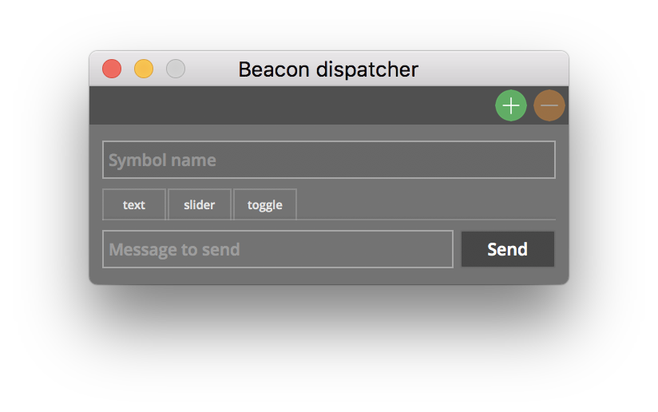
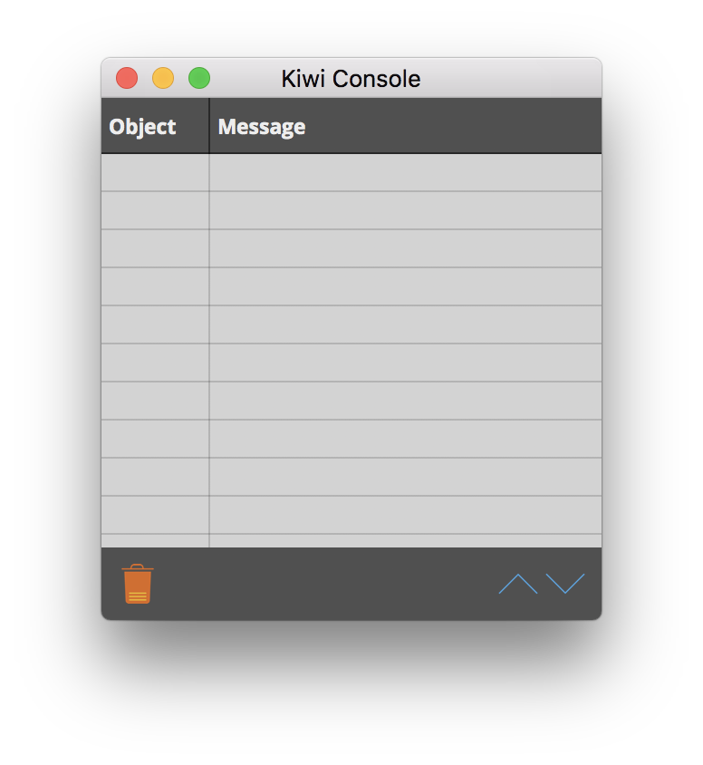
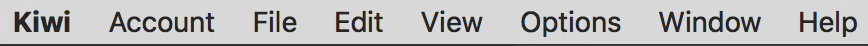
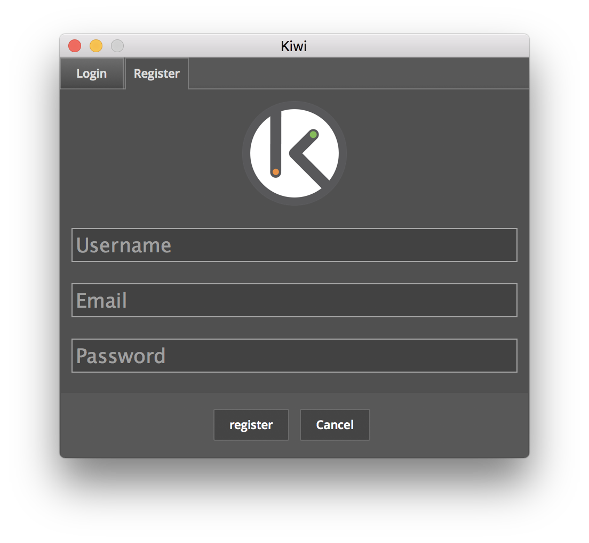
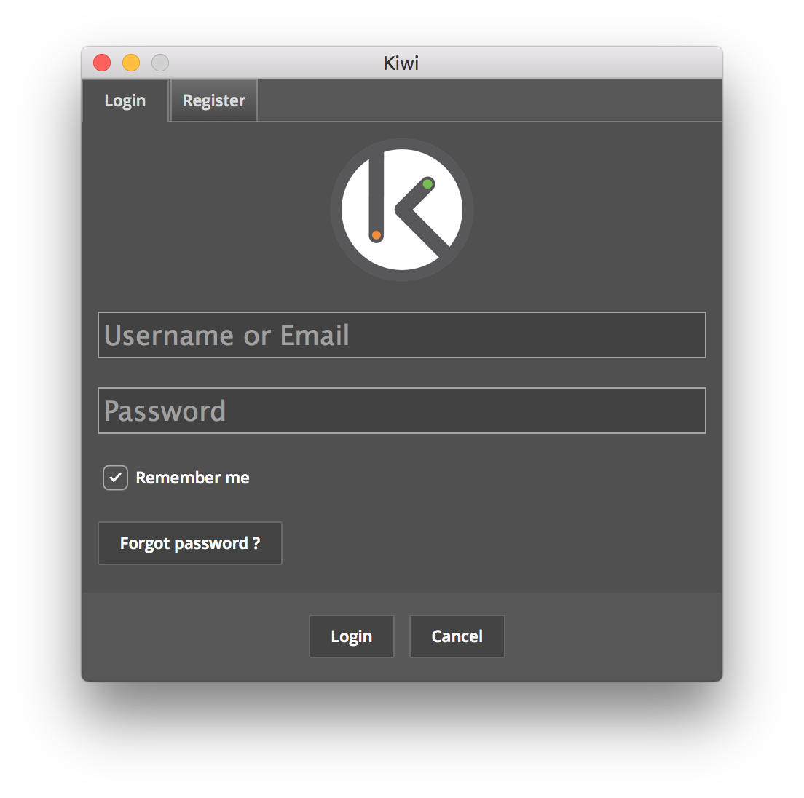
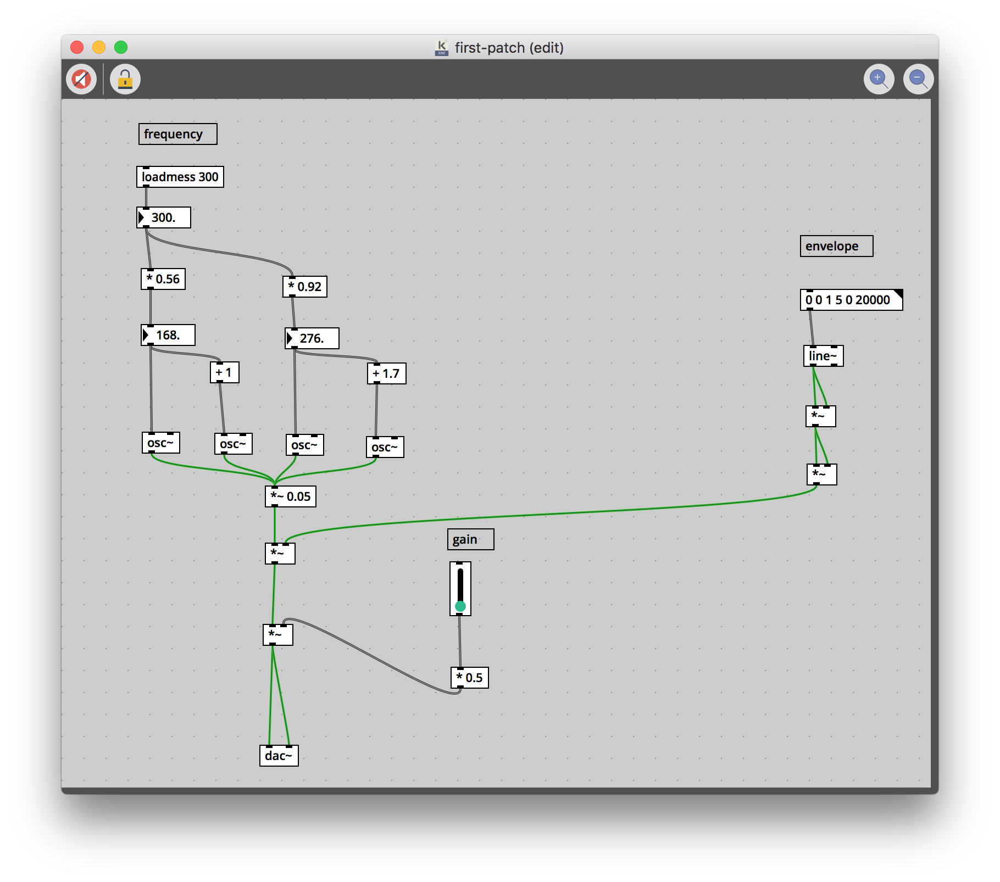
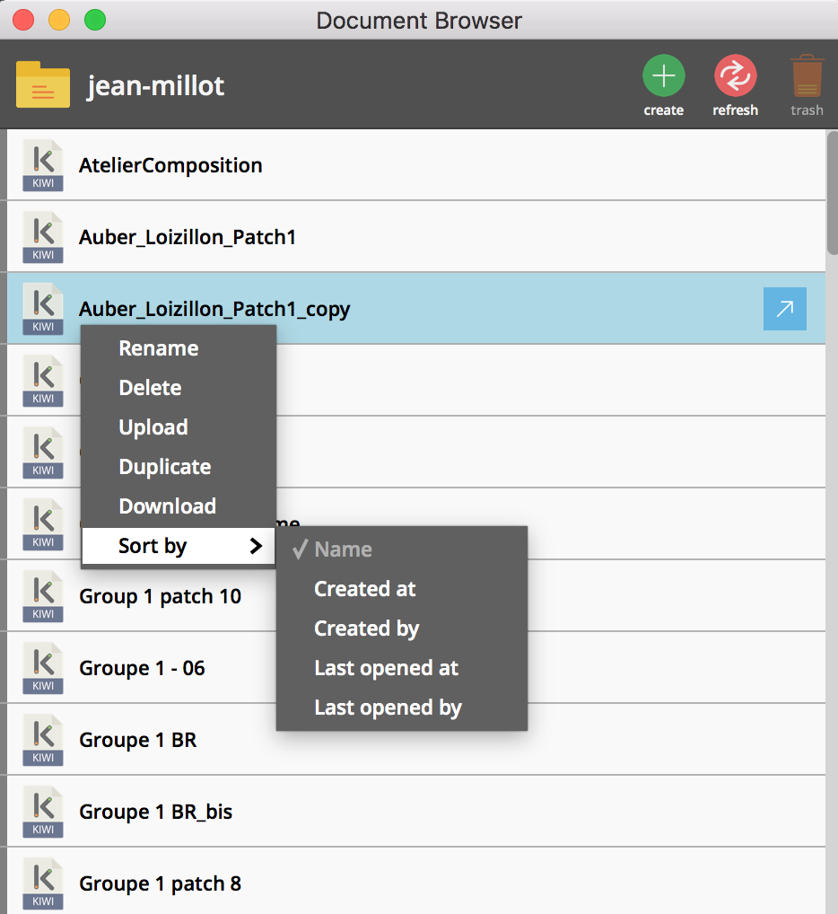
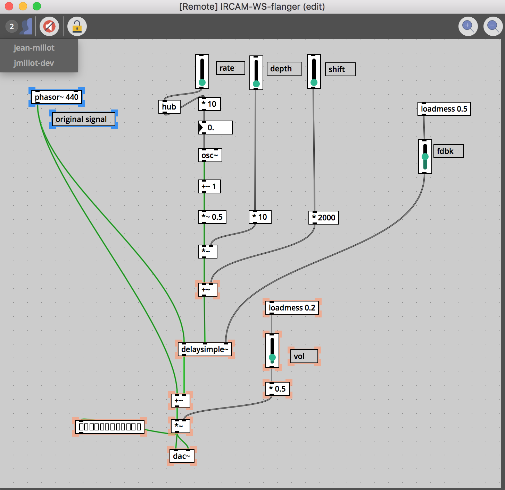

## Téléchargement

Le logiciel est disponible en téléchargement [ici](https://github.com/Musicoll/Kiwi/releases/latest). On y trouve une version pour chaque système d'exploitation, une liste de patchs d'aide qui montrent le comportement des objets, et un ensemble de tutoriaux pour guider le lecteur dans la création de certains traitements audionumériques temps réel.

## Compatibilité

Kiwi est compatible avec les trois systèmes d'exploitation principaux :

- MacOS : version 10.7 et ultérieures.
- Windows : windows 7 et ultérieures.
- Linux : la version a été testé avec ubuntu 14.04

## Installation

Une fois le téléchargement effectué, l'archive correspondante est extraite par un double-clic sur l'icône. Un dossier Kiwi contenant l'application est alors créé. Sur MacOS et Linux, il faut copier l'application vers le dossier contenant les applications (Applications sur MacOS, /usr/bin sur Linux). Sous Windows, il faut exécuter l'installeur.

## Lancement de Kiwi

Quand Kiwi est lancé, trois fenêtres principales apparaissent : le Document Browser, le Beacon Dispatcher et la console Kiwi.

<table style="border: 0px">
    <tr>
        <th style="border: 0px"></th>
        <th style="border: 0px"></th>
        <th style="border: 0px"></th>
    </tr>
</table>

La barre des menus apparaît en haut de l'écran ou comme entête de la console Kiwi sur Windows.

## Connexion

Il y a deux manières de se connecter au serveur Kiwi : soit en créant un compte utilisateur, soit en utilisant un compte déjà créé. Pour créer un compte, il faut cliquer sur 'Register' dans le menu 'Account'. Une fenêtre d'enregistrement apparaît. Il faut entrer son nom d'utilisateur (user name), son adresse email et son mot de passe. Après avoir cliqué sur le bouton 'register', l'utilisateur reçoit un email contenant un lien temporaire permettant de valider la création de compte.

Pour se connecter à un compte utilisateur existant, il faut cliquer sur 'login' dans le menu 'Account'. Une fenêtre de connexion apparaît. Il faut entrer son adresse email ou son nom d'utilisateur (user name) et son mot de passe. En cas d'oubli de son mot de passe, il est possible de le réinitialiser en utilisant son adresse email, en cliquant sur le bouton 'Forgot password'.

## Premier patch

A ce point, il est soit possible de rejoindre un patch partagé en utilisant la fenêtre du Document Browser ou d'ouvrir un patch local. Dans cette section, nous montrerons comment ouvrir et manipuler un patch local. Les indications sur les manières de collaborer seront données un peu plus loin dans cette documentation.

Ouvrez le patch **first-patch.kiwi** distribué avec les [tutoriels](https://github.com/Musicoll/Kiwi/releases/download/v1.0.3/documentation.zip).

Comme on peut le voir, un patch est un ensemble d'objets, chacun exécutant une opération. Les données, soit de contrôle, soit des signaux, sont envoyées entre les objets par les connexions. Les connexions en gris sont utilisées pour envoyer des messages (nombres, chaînes de caractères, listes, bangs, etc.) tandis que les connexions en vert transportent les signaux de haut en bas.

Le premier patch est un générateur de son (synthèse) : la partie en haut à gauche est le générateur.La partie en haut à droite est utilisée pour déclencher une enveloppe d'amplitude. Le signal est ensuite envoyé vers un contrôle de gain maître et l'objet dac~ qui représente la sortie audio du patch.

Un patch peut soit être en mode édition soit en mode exécution (bloqué). En mode exécution (bloqué), les objets graphiques (le potentiomètre de gain est un exemple d'objet graphique) sont actifs et peuvent être manipulés pour générer différents sons. Pour basculer du mode exécution (bloqué) au mode édition, il faut soit cliquer sur le bouton lock

 ou enfoncert les touches Cmd + E (Ctrl + E for linux or windows users).

Le traitement audio temps réel est par défaut désactivé. Pour allumer l'audio, il faut cliquer sur l'icône de haut-parleur en haut à gauche du patch .

Une fois le patch en mode exécution et l'audio allumé, vous pouvez augmenter le gain en utilisant le potentiomètre "gain"; vous pouvez générer le son en cliquant sur l'objet-message "enveloppe" (en-dessous du commentaire "enveloppe") et ajuster la fréquence du son engendré par l'objet-nombre qui contrôle la fréquence (par un "drag" à la souris).

## Collaboration

Dans cette section, nous décrivons comment il est possible de rejoindre un patch et de collaborer avec d'autres utilisateurs.

Pour collaborer avec les autres utilisateurs, il est possible d'utiliser le "document browser" et d'ouvrir un patch qui est édité par une autre personne. Il n'y a pas de solution de "chat" dans Kiwi, mais on peut utiliser n'importe quel autre logiciel de "chat" pour vous retrouver et échanger tout en travaillant ensemble.

Comme on peut le constater, le "document browser" présente une liste de documents accessible par tout le monde. Télécharger, remonter vers le serveur, renommer, supprimer, dupliquer un patch est possible par un clic droit sur le "document browser". Il est également possible de trier des documents selon différents critères.

Pour commencer à collaborer, double-cliquer sur un patch.

Une fois que l'on a rejoint le document, on peut cliquer en haut à gauche pour voir les utilisateurs qui travaillent au même moment sur le patch, en édition ou en exécution. Les objets sélectionnés par les autres utilisateurs sont surlignés en orange, tandis que la sélection personnelle est montrée en bleu.

On peut ensuite éditer ou jouer librement le patch avec les autres utilisateurs.
