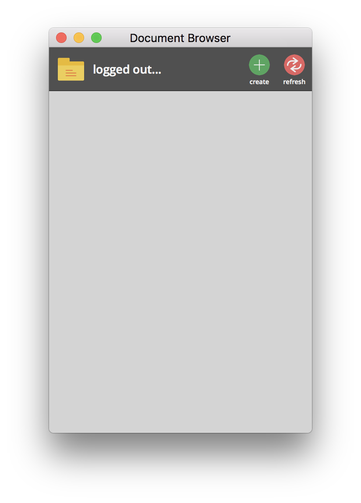
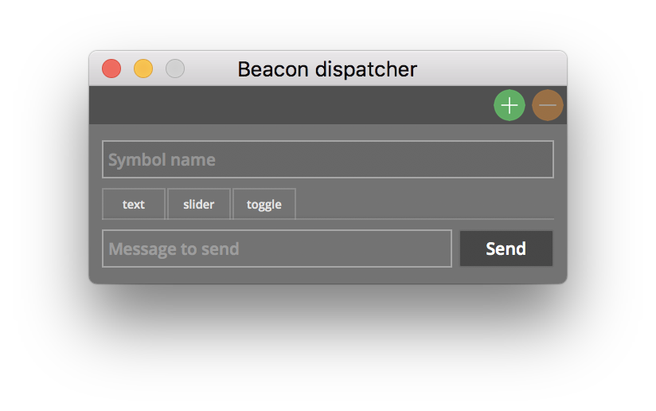
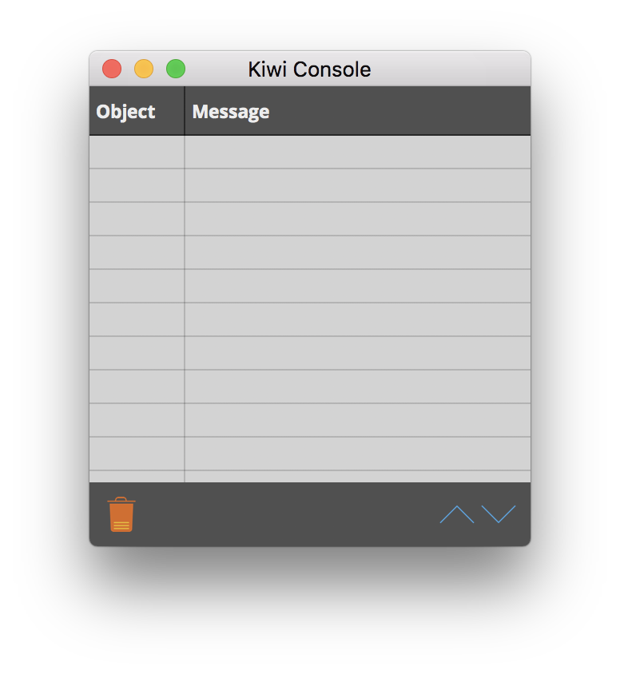
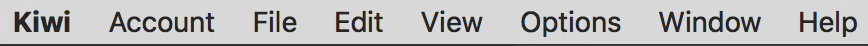
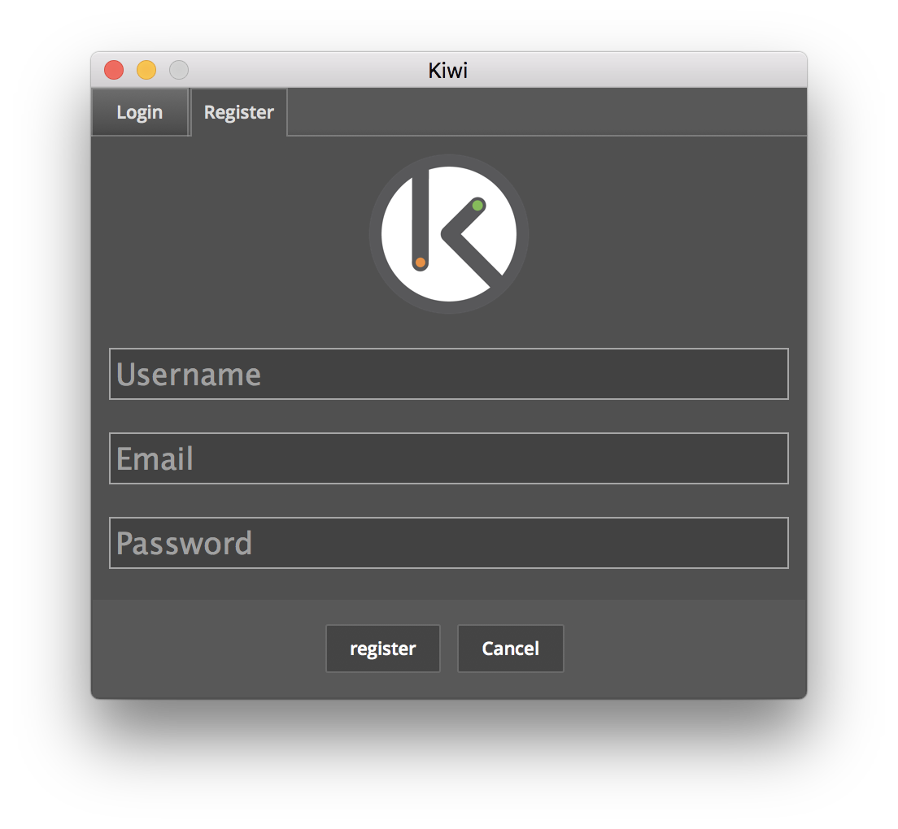
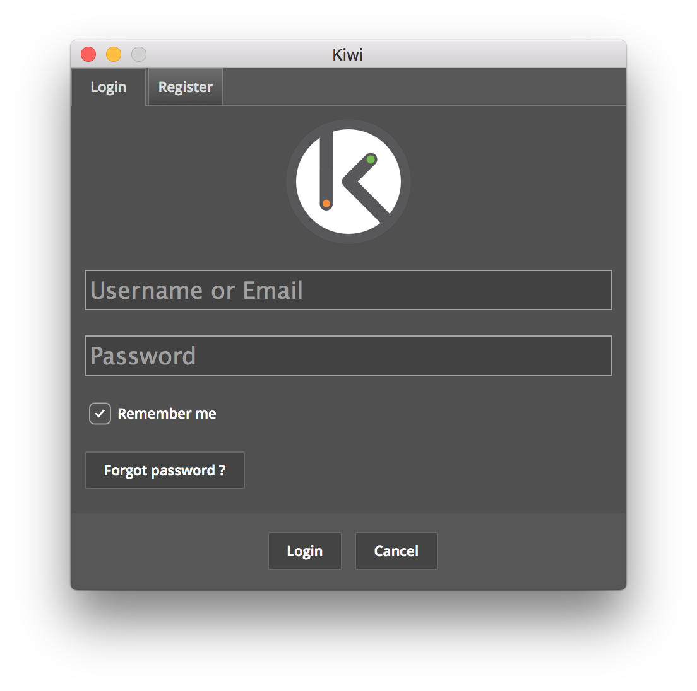
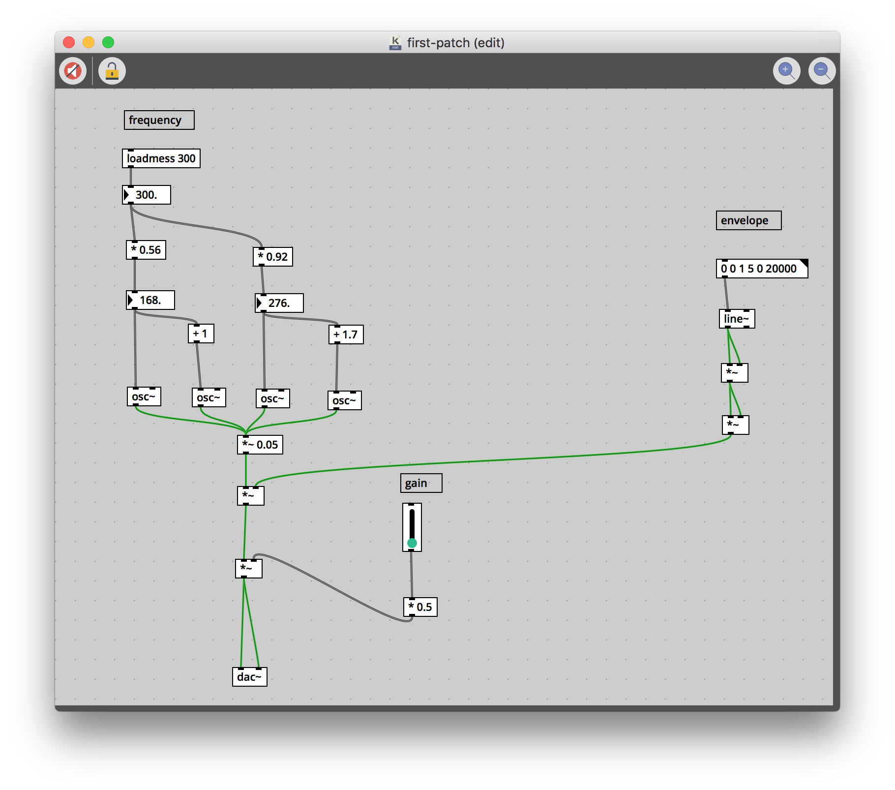
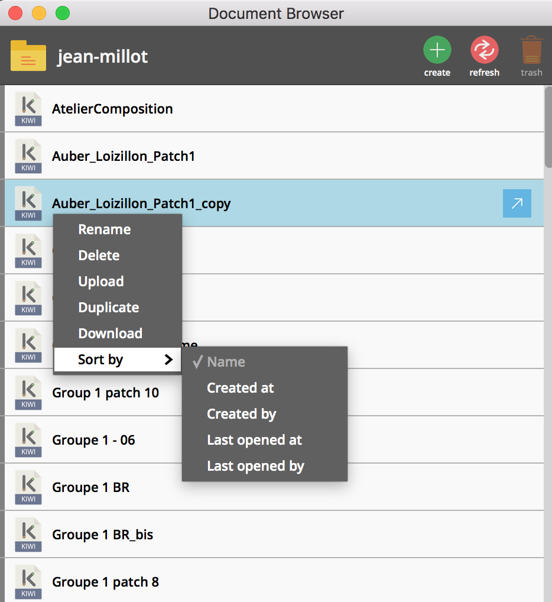
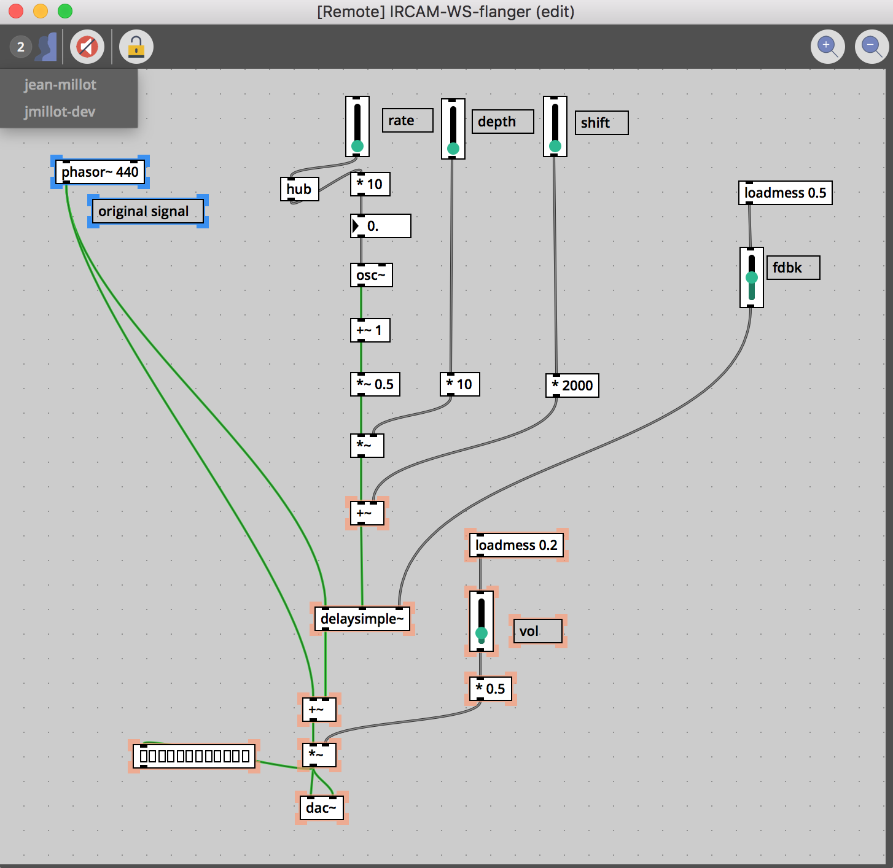

# Getting started

## Download

Please follow this [link](https://github.com/Musicoll/Kiwi/releases/latest) to download the software. You'll find a version for each operating system, a list of help patches that describes the objects' behaviour and a set of tutorials guiding through creating certain audio processing.

## Compatibility

Kiwi is compatible with the three main operating system.

- Macos : version 10.7 and later.
- Windows : windows 7 and later.
- Linus : tested with ubuntu 14.04

## Installing

Once download is complete, the corresponding archive shall be extracted by double clicking on it. A Kiwi folder containing the application is then created. On macos and linux copy the application to your app folder (Application folder on Mac, /usr/bin on linux). Windows users may execute the installer.

## Lauching Kiwi

When Kiwi is executed three main windows appear : The Document Browser, the Beacon Dispatcher and Kiwi's console.

<table style="border: 0px">
    <tr>
        <th style="border: 0px"></th>
        <th style="border: 0px"></th>
        <th style="border: 0px"></th>
    </tr>
</table>

The menu bar appears on top of your screen or as a header of Kiwi's console on windows.

## Signing up

There is two options to connect to Kiwi's server: either create a user account or use an already created account. To create an account, click on 'Register' under 'Account' menu. A register window appears. Enter your username, your email adress and your passowrd. After clicking the register button the user receives a email containing a temporary link enabling him to validate his account creation.

To connect to an existing user account, click on login in the menu 'Account'. A login window shows up. Enter your email address or username and your password. If you forgot your password, you can reset it using your email address by clicking on the button 'Forgot password'.

## First patch

At this point, you can either join a shared patch using the Document Browser window or open a local patch. In this section we will demonstrate how to open and manipulate a local patch. Instructions on how to collaborate will be given later.

Pease click on this <a href="../ressources/pathces/first-patch.kiwi" target='_blank_'>link</a> to download a first example and open the example with Kiwi.

As you can see, the patch is a set of objects each one carrying out an operation. Data either control or signal data is sent between objects using links. Grey connections are used to send messages (numbers, strings, lists, bang ect...) whereas green connections send signals from top to bottom.

This first patch is a generator of sound (synthesis) where the top-left part is the generator. The top-right is used to trigger a gain envelope. The signal is then sent to a master gain control and the dac~ object which represents the audio output of the patch.

A patch can either be in mode edition or in mode lock. In edition mode objects and links can be added, removed or edited. In mode lock, graphical objects (the gain slider is graphical is an example) are now enabled and can be manipulated to generate different sounds. To switch between mode lock and mode edition either click on the lock button
 or press Cmd + E (Ctrl + E for linux or windows users).

The audio processing is by default disabled, to put the audio on click on the speaker icon on the top left part of the patch .

Once you have locked the patch and started the audio processing you can increase the gain using the "gain" slider, you can generate the sound by clicking on the "envelope" message object (below "envelope" comment) and adjust the frequency of the generated sound by dragging the number object which controls the frequency.

## Collaborate

In this section we will describe how one can join a patch and collaborate with other users.

To collaborate with others one may use the document browser and open a document that is being edited by another collaborator. There is no chatting solution integrated in Kiwi's software but you can use another chatting software to meet up and speak while working together.

As you can see the document displays a list of documents accessible by anyone. Downloading, deleting, uploading, renaming, duplicating a patches is enabled by right clicking on the document browser. Sorting documents using different criteria is also possible.

Double click on a patch to start collaborating.

Once you have join the document you can click on the top left part to show users currently editing or using the patch. Objects currently selected by other users are hilighted in orange whereas your own selection is shown in blue.

You can now edit and/or play the patch as you will with others.
